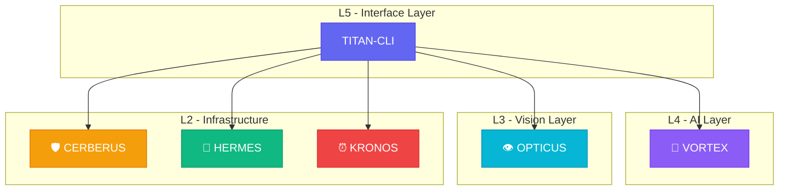

<div align="center">

```
╔══════════════════════════════════════════════════════════════════════════════╗
║                                                                              ║
║   ████████╗██╗████████╗ █████╗ ███╗   ██╗       ██████╗██╗     ██╗           ║
║   ╚══██╔══╝██║╚══██╔══╝██╔══██╗████╗  ██║      ██╔════╝██║     ██║           ║
║      ██║   ██║   ██║   ███████║██╔██╗ ██║█████╗██║     ██║     ██║           ║
║      ██║   ██║   ██║   ██╔══██║██║╚██╗██║╚════╝██║     ██║     ██║           ║
║      ██║   ██║   ██║   ██║  ██║██║ ╚████║      ╚██████╗███████╗██║           ║
║      ╚═╝   ╚═╝   ╚═╝   ╚═╝  ╚═╝╚═╝  ╚═══╝       ╚═════╝╚══════╝╚═╝           ║
║                                                                              ║
║                       ⚡ THE OPERATOR CONSOLE ⚡                              ║
║                                                                              ║
╚══════════════════════════════════════════════════════════════════════════════╝
```

[](https://www.rust-lang.org/)
[](https://github.com/DaviBonetto/TITAN-CLI-L5-Terminal-Commander/actions)
[](https://docs.rs/clap)
[](https://tokio.rs/)
[]()
[](LICENSE)

**The unified command-line interface for the Titan Protocol ecosystem.**

[Installation](#installation) • [Usage](#usage) • [Commands](#commands) • [Configuration](#configuration)

</div>

---

## 🌟 Overview

**TITAN-CLI** is an enterprise-grade command-line interface designed to orchestrate the entire Titan Protocol ecosystem. Inspired by modern CLI tools like Codex, Gemini CLI, and Claude Code, it provides a beautiful, fast, and intuitive interface for developers and operators.

### Key Features

- 🚀 **Lightning Fast** - Built in Rust for maximum performance
- 🎨 **Beautiful Output** - Rich colored terminal UI with spinners and progress bars
- 🔌 **Unified Interface** - Single CLI for all Titan Protocol services
- 📡 **Async by Default** - Non-blocking operations with Tokio runtime
- 🛡️ **Type-Safe** - Compile-time guarantees with Clap derive macros

---

## 📐 Architecture



---

## 📦 Installation

### From Source

```bash
# Clone the repository
git clone https://github.com/DaviBonetto/TITAN-CLI-L5-Terminal-Commander.git
cd TITAN-CLI-L5-Terminal-Commander

# Build release binary
cargo build --release

# Install globally (optional)
cargo install --path .
```

### Quick Install

```bash
# Using the setup script
./setup_titan_cli.sh
```

---

## 🚀 Usage

### Basic Commands

```bash
# Check status of all services
titan status

# Check status with details
titan status --detailed

# Query the VORTEX AI Engine
titan ask "Analyze sector 7"

# Stream VORTEX response
titan ask "Explain the architecture" --stream

# Connect to OPTICUS vision stream
titan vision --stream

# Deploy a service
titan deploy cerberus --env production

# Show version info
titan version
```

### Example Session

```bash
$ titan status

  ╔════════════════════════════════════════════════════════╗
  ║                TITAN PROTOCOL STATUS                   ║
  ╚════════════════════════════════════════════════════════╝

  SERVICE              STATUS
  ──────────────────────────────────────────────────────────
  🛡️ CERBERUS          [ONLINE]  ●
  ⏰ KRONOS            [OFFLINE] ○
  📨 HERMES            [ONLINE]  ●
  🧠 VORTEX            [ONLINE]  ●
  👁️ OPTICUS           [OFFLINE] ○
  ──────────────────────────────────────────────────────────

  ⚠ 3/5 services online
```

```bash
$ titan ask "Analyze sector 7"

  ╔════════════════════════════════════════════════════════╗
  ║                  VORTEX AI ENGINE                      ║
  ╚════════════════════════════════════════════════════════╝

  Query: Analyze sector 7
  Model: vortex-v3

  ──────────────────────────────────────────────────────────

  🧠 Analysis Complete.

  Based on my analysis using vortex-v3, I've identified:

    • Temporal variance detected in data streams
    • 3 anomalous signal patterns require attention
    • Recommended action: Deploy monitoring probes

  ──────────────────────────────────────────────────────────
```

---

## 📋 Commands

| Command                  | Aliases                | Description                        |
| ------------------------ | ---------------------- | ---------------------------------- |
| `titan status`           | `st`, `health`, `ping` | Check status of all Titan services |
| `titan ask <query>`      | `query`, `q`, `ai`     | Send query to VORTEX AI Engine     |
| `titan deploy <service>` | `dep`, `up`            | Deploy services to infrastructure  |
| `titan vision`           | `vis`, `eye`, `stream` | Connect to OPTICUS vision stream   |
| `titan config`           | `cfg`, `settings`      | Manage CLI configuration           |
| `titan version`          | `ver`, `info`          | Show version and system info       |

### Command Options

#### Status

```bash
titan status [OPTIONS]

Options:
  -s, --service <SERVICE>  Check a specific service only
  -d, --detailed           Show detailed information
  -v, --verbose            Enable verbose output
```

#### Ask

```bash
titan ask <QUERY> [OPTIONS]

Arguments:
  <QUERY>  The query to send to VORTEX

Options:
  -s, --stream         Use streaming response mode
  -m, --model <MODEL>  Specify model [default: vortex-v3]
```

#### Deploy

```bash
titan deploy <SERVICE> [OPTIONS]

Arguments:
  <SERVICE>  Service to deploy (cerberus, kronos, hermes, vortex, opticus)

Options:
  -e, --env <ENV>  Target environment [default: staging]
  -y, --yes        Skip confirmation prompt
```

---

## ⚙️ Configuration

### Environment Variables

| Variable        | Default                 | Description                |
| --------------- | ----------------------- | -------------------------- |
| `TITAN_API_URL` | `http://localhost:8080` | Titan API base URL         |
| `TITAN_TIMEOUT` | `30`                    | Request timeout in seconds |
| `TITAN_VERBOSE` | `false`                 | Enable verbose logging     |
| `NO_COLOR`      | `false`                 | Disable colored output     |

### Config File

Create `~/.titan/config.toml`:

```toml
[api]
endpoint = "http://localhost:8080"
timeout = 30

[ui]
theme = "dark"
color = true

[services]
cerberus = "http://localhost:8080"
kronos = "http://localhost:3000"
vortex = "http://localhost:8000"
```

---

## 🏗️ Project Structure

```
titan-cli/
├── Cargo.toml              # Project manifest
├── src/
│   ├── main.rs             # Entry point & CLI parser
│   ├── commands/
│   │   ├── mod.rs          # Commands module
│   │   ├── status.rs       # Service health checking
│   │   ├── ask.rs          # VORTEX AI queries
│   │   ├── deploy.rs       # Deployment engine
│   │   └── vision.rs       # OPTICUS stream
│   └── utils/
│       ├── mod.rs          # Utils module
│       ├── client.rs       # HTTP client wrapper
│       └── ui.rs           # Terminal UI helpers
├── README.md
├── LICENSE
├── CHANGELOG.md
└── setup_titan_cli.sh
```

---

## 🔧 Development

### Prerequisites

- Rust 1.70+ (with Cargo)
- Git

### Build Commands

```bash
# Development build
cargo build

# Release build (optimized)
cargo build --release

# Run tests
cargo test

# Format code
cargo fmt

# Lint check
cargo clippy
```

### Running Locally

```bash
# Run with cargo
cargo run -- status

# Or with the binary directly
./target/release/titan status
```

---

## 📈 Performance

| Metric       | Value                |
| ------------ | -------------------- |
| Binary Size  | ~2.5MB (stripped)    |
| Startup Time | <10ms                |
| Memory Usage | ~5MB idle            |
| Async Tasks  | Tokio multi-threaded |

---

## 🤝 Contributing

Contributions are welcome! Please read our [Contributing Guide](CONTRIBUTING.md) for details.

1. Fork the repository
2. Create a feature branch (`git checkout -b feat/amazing-feature`)
3. Commit changes (`git commit -m 'feat: add amazing feature'`)
4. Push to branch (`git push origin feat/amazing-feature`)
5. Open a Pull Request

---

## 📄 License

This project is licensed under the MIT License - see the [LICENSE](LICENSE) file for details.

---

<div align="center">

**Built with ❤️ by the Titan Protocol Engineering Team**

⚡ _The Operator Console_ ⚡

</div>
